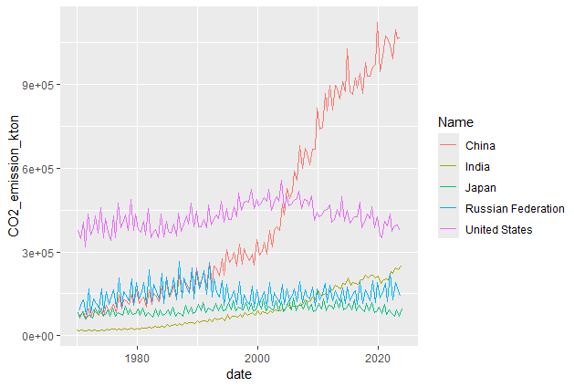
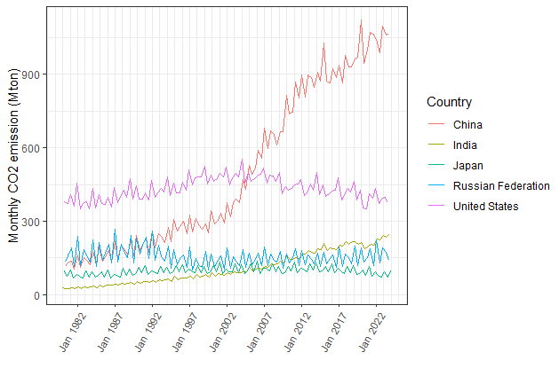

<center></center>

# Dates and date-times in R

### Tutorial Aims

1.  Understand how dates and date-times are stored in R

2.  Learn to use `lubridate` to manipulate dates and date-times more easily

3.  Explore visualisation of time series in R

### Tutorial Steps

1.  <a href="#section1"> Create and understand dates and times in Base R</a>

    1.1 <a href="#section2"> Parsing dates and date-times in Base R</a>
    
    1.2 <a href="#section3"> Understanding dates in R </a>
    
    1.3 <a href="#section4"> Formatting dates in Base R </a>

2.  <a href="#section5"> Using lubridate to simplify dates and times</a>

    2.1 <a href="#section6"> Parsing dates and date-times with `lubridate`</a>
    
    2.2 <a href="section7"> Time Zones </a>
    
    2.3 <a href="#section8"> Accessing and editing dates and date-times </a>
    
    2.4 <a href="#section9"> Time spans </a>

3.  <a href="#section10"> Visualising time series data</a>

4.  <a href="#section11"> Challenge</a>


In this tutorial we're going to learn how to deal with dates and date-times in R. This may seem like a fairly niche topic, but much of ecological and environmental data involves dates and times, particularly time series and phenological data. Some understanding of how this data is managed in R can help manage it correctly and visualise the data in an informative way.

## Downloading data

We're going to use two different data sources in this tutorial: phenology data describing the timings of natural events of tree species in the International Phenology Garden at Alice Holt, Hampshire (more information can be found [here](https://www.data.gov.uk/dataset/f9994171-c71f-4aff-b738-54d40b96112c/observations-from-the-international-phenology-garden-at-alice-holt-hampshire-2005-2015)) and monthly CO2 emission estimates of different countries from the Emissions Database for Global Atmospheric Research (EDGAR) (more information can be found [here](https://edgar.jrc.ec.europa.eu/dataset_ghg2024#intro)). This data has been reformatted and subsetted, and times have been added, to make it more suitable for this tutorial, but the actual dates are still correct.

You can access this data by going to [this repository](https://github.com/EdDataScienceEES/tutorial-evadowding.git) and cloning and downloading the repository as a zip file. You can then set your working directory as shown in the code below. Make a new R script with `File/New File/R Script` or with `Ctrl+Shift+N`.

``` r
# Tutorial on dates and date-times
# Your name here
# Current date here
# Any important notes

# Load libraries ----
# install.packages("lubridate")  # Run this if you haven't got lubridate installed already
library(lubridate)  # Date and time manipulation
library(dplyr)  # Data manipulation package
library(ggplot2)  # Data visualisation package
library(tidyr)  # Data tidying package

# Load data
phenology <- read.csv("data/messy_phenology.csv")  # Loading in Alice Holt Phenology data
emissions <- read.csv("data/CO2_1970_2023.csv")  # Loading in IEA EDGAR CO2 data

```

We can now have a look at the `phenology` data using `glimpse()` from the `dplyr` package. We'll use the `emissions` data later.

```r
# Explore the data
glimpse(phenology)
```

This has the dates and times of observation of many different phenological events over 7 years. You can see that all of the variables load in as character variables, apart from the index `X` and the year `X2008`.

<a name="section1"></a>
<a name="section2"></a>

## 1. Create and understand dates and times in Base R

### 1.1 Parsing dates and date-times in Base R

Dates and date-times are two different data classes in R. There is not a base R time data class, the library `hmu` deals with that but that is beyond the scope of today's tutorial. The date class is simply called `Date`, while the date-time class is called `POSIXlt`. They are written as year-month-day hour:minute:second, or just year-month-day. 

We will define a date and a date-time below using the `as.Date` and `as.POSIXlt` functions. We are "parsing" the date here, i.e. the function is looking through the input and extracting the information used to make a date.

```r
# Parsing dates and date-times in base R
date <- as.Date("2015-06-13")  # Defining a date
datetime <- as.POSIXlt("2016/03/30 13:40:05")  # Defining a date-time

# Now try converting them to numbers. What do you get?
as.numeric(date)

as.numeric(datetime)

```
You get 16599, then 1459243605, but what do they mean?

<a name="section3"></a>

### 1.2 Understanding dates in R

Dates in R are stored as the number of days since 1st January 1970 UTC, and date-times are stored as the number of seconds since then. This means that there were 16599 days between 1970/01/01 and 2015/06/13, and 1459243605 between 1970/01/01 and 2016/03/30 13:40:05. 
If you want to find out exactly how many seconds have passed since 01/01/1970, you can run `as.numeric(Sys.time())` and likewise, for the number of days you can run `as.numeric(Sys.date()).` `Sys.time()` and `Sys.date()` give you the current time and date according to your computer.

You might have noticed that in the above example, in our date we used dashes to separate our date, whereas in the date-time we used forward slashes. Either is fine. The important thing here is the order of year/month/date.

<a name="section4"></a>

### 1.3 Formatting dates in Base R

This is fine, but when we have dates and times in many different formats, things begin to get a bit complicated. If you have another `glimpse()` at the `phenology` data, you will see that every year has their event dates in a different format. We can deal with this in base R, but it does begin to get a bit complicated. If we wanted to make a date from the character string "August 7th 1989", we can use the code below.

```r
# Formatting
as.Date("August 7th, 1989")  # This just produces an NA!

as.Date("August 7th, 1989", format = "%B %dth, %Y")  # We have to tell R what format the date is in.

# Or for another date-time format:
as.POSIXlt("15 Jan 2002 03:15", format = "%d %b %Y %H:%M")

```

These functions can also run on vectors etc.
```r
# Create a vector of character dates
date_vec <- c("3 Dec 2020", "10 Dec 2021", "15 Dec 2025")

# Convert to dates, format and print
(date_vec <- as.Date(date_vec, format = "%d %b %Y"))
```


This can get quite complicated quite quickly, not to mention when we get into time zones and timelines (we'll come to that later). 

|Code	|Meaning	|Code	|Meaning |
|-----|-----|-----|-----|
|%a	|Abbreviated weekday	|%A	|Full weekday |
|%b	|Abbreviated month	|%B	|Full month |
|%c	|Locale-specific date and time	|%d	|Decimal date |
|%H	|Decimal hours (24 hour)	|%I	|Decimal hours (12 hour) |
|%j	|Decimal day of the year	|%m	|Decimal month |
|%M	|Decimal minute	|%p	|Locale-specific AM/PM |
|%S	|Decimal second	|%U	|Decimal week of the year (starting on Sunday) |
|%w	|Decimal Weekday (0=Sunday)	|%W	|Decimal week of the year (starting on Monday) |
|%x	|Locale-specific Date	|%X	|Locale-specific Time|
|%y	|2-digit year	|%Y	|4-digit year |
|%z	|Offset from GMT	|%Z	|Time zone (character) |

Don't worry about learning this! It's just to demostrate how complicated dates can get. We'll use the package `lubridate` to simplify this.


<a name="section5"></a>

<a name="section6"></a>

## 2. Using lubridate to simplify dates and times

### 2.1 Parsing dates and date-times with `lubridate`

We can avoid most of this formatting struggle with a package called `lubridate`! This package was made to simplify how we handle dates and date-times in R, and has some useful functions.

We'll use our `phenology` data again here to explore the `lubridate` package. 

Our data is still all character data in different formats, but we can easily handle this with `lubridate`! To parse dates and date-times, we have a number of different functions such as `ymd()`, `dmy()` and `dmy_hms()`. These letters stand for year, month, day, hour, minute and second, and they can be reordered to suit whatever format your data is in. Let's have a look at this working below.

```r
glimpse(phenology)

# Column X2005 is in the format day/month/year, so we can use the dmy() function
dmy(phenology$X2005)
# This should output dates in a standard format

# Column X2006 has times as well! It is in the format day/month/year h:m, so use the dmy_hm() function
dmy_hm(phenology$X2006)
# Check the output here!

```
<a name="section7"></a>

### 2.2 Time Zones

Did you notice the letters after the times in the X2006 date-times? These are the time zones of the date-times, and the function assumes they are in the Universal Time Coordinated (UTC) time zone. This is the roughly the same as Greenwich Mean Time. Only date-times, and not dates, have time zones associated with them.

`lubridate` uses a global list of time zones that can be viewed with the function `OlsonNames()`. There are quite a lot of time zones here, so you can view the one your computer is in easily using the `Sys.timezone()` function. Depending on where and when you are looking at this, your time zone may not be UTC. 

The data may also not have been collected in UTC! This won't always matter too much, but if you are interested in exact durations of time with your data, it might get messed up by timezone shifts if you don't account for this (e.g. if your data is collected across the world, or in a country with Daylight Savings Time). We can specify the timezone of our date-times by adding a `tz = ` argument to our function like so.

```r
# Specifying the time zone the data were collected in
dmy_hm(phenology$X2006, tz = "Europe/London")  # These data were collected in Hampshire, England
# See how some data are set to British Summer Time (BST) and some are set to Greenwich Mean Time (GMT)
```

<a name="section8"></a>

### 2.3 Accessing and editing dates and date-times

If you want to extract or change elements of dates and date-times, `lubridate` has you covered! These functions are helpfully named, e.g. `date()` for accessing a date, `hour()` for accessing an hour etc. Have a look below.

```r
# First we should set the data type in the phenology set to date or date-time
phenology$X2005 <- dmy(phenology$X2005)

# Check the days of the month recorded in 2005
day(phenology$X2005)

# Check the month that phenological events occurred in 2005
month(phenology$X2005)

# Check that the years are all correct in the 2005 column
year(phenology$X2005)

# Check which week of the year phenological events occurred in 2005
week(phenology$X2005)

# Check the weekday of the 2005 records
wday(phenology$X2005)

# We can do the same with a date-time!
# First set column X2006 to date-time
phenology$X2006 <- dmy_hm(phenology$X2006, tz = "Europe/London")

# Look at the date component of a date-time
date(phenology$X2006)

# Check the hour
hour(phenology$X2006)

# Check the minute
minute(phenology$X2006)

# Check the second
second(phenology$X2006)

# Check the time zone
tz(phenology$X2006)

```

All you need to do to edit these values is assign them a new value.

```r
# Check initial value 
phenology$X2005[1]

# Change the month from April to May
month(phenology$X2005[1]) <- 5

# Check final value
phenology$X2005[1]
```

<a name="section9"></a>

### 2.4 Time spans

There are 3 different ways to treat time spans in `lubridate`. They exist mostly to deal with timeline irregularities such as leap years, time zone changes or leap seconds. These can mess with date and date-time data because it means that the lengths of minutes, hours, days, months and years are not constant. You can use whichever form makes sense for your data.

#### 2.4.1 Periods

Periods only measure differences between times on a clock or calendar. This means that they ignore timeline irregularities. For example, in the UK the clocks go back by one hour at 2 am on the last Sunday in October, and the _period_ between 1 am and 2 am would only be an hour, despite the fact that the hour of 1 o'clock had happened twice. 

We might use these if we were interested in events that happen at a specific time according to the clock, such as what times roads were busiest on workdays. Humans pay attention to clocks!

Periods in `lubridate` are defined by _plurals_ and can be added or subtracted from dates and date-times.

```r
# Creating a period
period <- years(13) + months(1) + days(39)
# Look at the period - how is it shown in R?
period

# Adding a period to a date
phenology$X2006[1]  # View the initial date
phenology$X2006[1] + period  # View the new date

# Measuring the period between two dates
as.period(phenology$X2006[2] - phenology$X2006[1])
```

Periods are stored as a number of units such as years, days and hours.


#### 2.4.2 Durations

Durations are the amount of time that has *actually* passed, i.e. how much time an observer would notice passing. When the clocks go back in October, the duration between 1 am and 2 am would be 2 hours.

These might be useful to us if we were interested in physical processes, (which, if you're an ecologist or environmental scientist, you often are!) such as if you were measuring incubation time of bird eggs, or the persistence of a pollutant in a waterbody.

Durations in `lubridate` are defined with a _d_, e.g.

```r
# Creating a duration
duration <- dyears(13) + dmonths(1) + ddays(39)
# Look at the duration - how is it shown in R?
duration

# Adding a duration to a date
phenology$X2006[1]  # View the initial date
phenology$X2006[1] + duration  # View the new date - is it the same as when we added the period?

# Measuring the duration between two dates
as.duration(phenology$X2006[2] - phenology$X2006[1])

```

Durations in R are stored as the number of seconds that would pass, as seconds are the main unit of time we're dealing with that is constant.


#### 2.4.3 Intervals

The thirds type of time span in `lubridate` is an interval. These are made up of a start and end date-time, and as a result they can be converted to periods or durations. 

They might be useful if you were checking whether dates and date ranges overlapped, e.g. comparing whether bird eggs hatched within or outwith the average hatching interval, or checking how breeding seasons of neighbouring deer populations overlapped.

Intervals are defined using the `interval()` function.

```r
# Creating an interval
interval1 <- interval(phenology$X2005[1], phenology$X2005[2])
# Look at interval 1
interval1

# Does Quercus robus leaf unfolding occur within interval 1 in 2005?
phenology$X2005[3] %within% interval1

# Create a second interval
interval2 <- interval(phenology$X2005[3], phenology$X2005[4])
# Look at interval 2
interval2

# Do these intervals overlap?
int_overlaps(interval1, interval2)
```

You can do some other interesting things with intervals, such as converting them to periods and durations, or shifting them along the timeline. I recommend having a look at [R for Data Science](https://r4ds.had.co.nz/dates-and-times.html#dates-and-times) or the [Lubridate website](https://lubridate.tidyverse.org/) if you'd like some more information.

<a name="section10"></a>

## 3. Visualising time series data

Here is a brief introduction to plotting time series data in R. I will be using `ggplot2` in this tutorial. If you'd like to learn more about `ggplot2`, make sure to have a look at the Coding Club data visualisation [tutorials](https://ourcodingclub.github.io/tutorials.html).

We'll be plotting up the `emissions` data set mentioned earlier. Let's have a look at it.

```r
glimpse(emissions)
```
This data is in a wide format, so the first thing we will need to do is put it into long format. GGplot uses the `date` data class to plot dates, so next we'll create a date column with the Month and Year columns.

```r
# Getting the data into the correct form
long_emissions <- emissions %>% 
  pivot_longer(cols = Jan:Dec,
               names_to = "Month",
               values_to = "CO2_emission_kton") %>%  # Pivot data to long form 
  mutate(date = ym(paste(Year, Month)))  # Create a date with ym() function from Year and Month columns
```
Now we're going to plot the top 5 emitters of CO2 since 1970. We will first find which countries have the highest emissions.

```r
# Finding top 5 emitters
total_emissions <- long_emissions %>%
  group_by(Name) %>%  # Group by country
  mutate(Total_emissions = sum(CO2_emission_kton)) %>%  # Make a new column for total emission
  ungroup() %>%  # Ungroup
  arrange(desc(Total_emissions))  # Arrange from highest emission to lowest
  
unique(total_emissions$Name)  # Print the countries in order of total emission
# Top countries are China, United States, Russian Federation, Japan and India

```
We'll now filter our data for plotting.
```r
# Filtering data for plotting
plot_emissions <- long_emissions %>% 
  filter(Name == c("China", "United States", "Russian Federation", "Japan", "India")) %>% 
  select(c(Name, date, CO2_emission_kton))
```
And now for plotting! Luckily ggplot recognises dates easily, all that is left for us to do is a bit of formatting. 

```r
# Basic plotting of data
(plot <- ggplot(plot_emissions, aes(x = date,  # Date on the X axis
                                    y = CO2_emission_kton,  # CO2 on the Y axis
                                    colour = Name)) +  # Colour by country 
  geom_line())  # Line graph
```



The `scale_x_date()` element can be used to change the axis labels. We'll also add some labels, learn to limit the date range and make the axes more readable. If you'd like to learn more about data visualisation in `ggplot`, have a look at [Coding Club's Tutorials](https://ourcodingclub.github.io/tutorials.html).
```r
# Making this a bit nicer
(nice_plot <- ggplot(plot_emissions, aes(x = date, 
                                         y = CO2_emission_kton/1000,  # Convert emission to megatons
                                         colour = Name)) +
    geom_line() +
    theme_bw() +
    xlab("") +  # Date is self explanatory! 
    ylab("Monthly CO2 emission (Mton)") +  # Y is now in Megatons
    labs(colour = "Country") +  # Change legend title
    scale_x_date(date_labels = "%b %Y",  # Using the table from earlier! Label formatting
                 date_breaks = "5 years",  # How spaced are the axis labels?
                 date_minor_breaks = "1 year",  # How spaced are the minor gridlines?
                 limit = c(ym("1980 Jan"), NA)) +  #  Limiting date range from 1980 to maximum
  theme(axis.text.x=element_text(angle=60, hjust=1)))  # Angle axis labels for readability

```



Now we have a nicely formatted plot of a time series of data!

## Summary

You have completed this tutorial on dates and date-times in R! In this tutorial we have:

##### - improved understanding of dates and date-times in R

##### - learned to use `lubridate` to better manipulate dates and date-times

##### - plotted and formatted basic time series graphs in `ggplot`


<a name="section11"></a>

## 4. Challenge

For some more practice, take another look at the `phenology` dataset. See if you can parse each year column into a date class using `lubridate`. Then, choose a species and try to make a boxplot of the dates of different phenological events. You should consider how you'll filter the data, and how you'd like to format the axes.

_HINT: You can use `geom_boxplot()` instead of `geom_line()` to make a boxplot. Salix smithiana* (Germany) has lots of entries._


<video src="images/fresh_rolex.mp4" width="300" height="240" controls></video>
